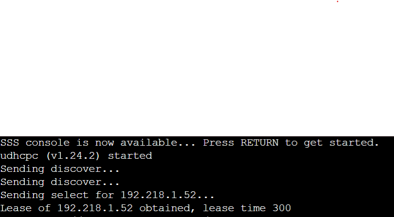
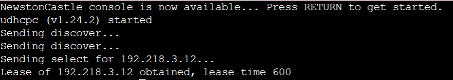
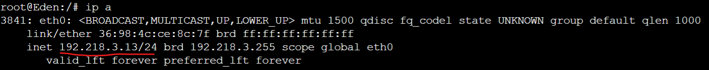

# Jarkom-Modul-3-ITB08-2022

## Anggota:
| Nama                      | NRP        |
|---------------------------|------------|
| Salsabila Briliana A. S.  | 5027201003 |
| Muhammad Rifqi Fernanda   | 5027201050 |
| Gilang Bayu Gumantara     | 5027201062 | 


## Soal 6
---
Lama waktu DHCP server meminjamkan alamat IP kepada Client yang melalui Switch1 selama 5 menit sedangkan pada client yang melalui Switch3 selama 10 menit. Dengan waktu maksimal yang dialokasikan untuk peminjaman alamat IP selama 115 menit.

### Solution
---
Server Westalis
Pada subnet interface switch 1 dan 3 ditambahkan konfigurasi berikut pada file `/etc/dhcp/dhcpd.conf`

```
subnet 192.218.2.0 netmask 255.255.255.0 {
}
subnet 192.218.1.0 netmask 255.255.255.0 {
    ...
    default-lease-time 300;
    max-lease-time 6900;
}

subnet 192.218.3.0 netmask 255.255.255.0 {
    ...
    default-lease-time 600;
    max-lease-time 6900;
}
```

### Testing
---
- Server SSS (Switch 1)

- Server NewstonCastle (Switch 3)


## Soal 7
---
Loid dan Franky berencana menjadikan Eden sebagai server untuk pertukaran informasi dengan alamat IP yang tetap dengan IP [prefix IP].3.13

### Solution
---
**Server Westalis**
Menambahkan konfigurasi untuk fixed address pada `/etc/dhcp/dhcpd.conf`

```
host Eden {
    hardware ethernet 36:98:4c:ce:8c:7f;
    fixed-address 192.218.3.13;
}
``` 

**Server Eden**
Setelah itu mengganti konfigurasi pada file `/etc/network/interfaces`

```
auto eth0
iface eth0 inet dhcp
hwaddress ether 36:98:4c:ce:8c:7f
```

### Testing
---
- IP Eden


